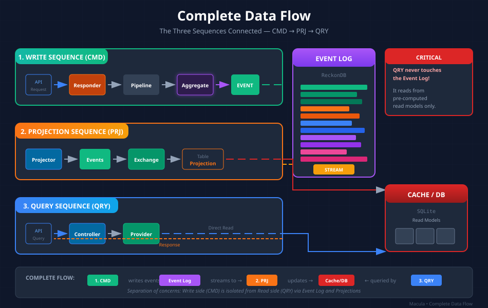

# Division Architecture: Overview

> *Note: "Cartwheel" is the historical name for what is now called "Division Architecture".*

> *"Majestic Modularity"* — A conceptual framework for organizing event-sourced systems using vertical slices.



## What is Division Architecture?

The Division Architecture is a visual and conceptual model for organizing complex, event-sourced systems. It provides a powerful mental model for understanding how different parts of a system relate to each other.

Think of it as a wheel:

| Component | What it Represents | In Macula |
|-----------|-------------------|-----------|
| **Hub** | Aggregate State (the core domain) | Domain aggregates (`*_aggregate.erl`) |
| **Desks** | Vertical Slices (business capabilities) | Command slices (`announce_capability/`, `track_rpc_call/`, etc.) |
| **Outer Ring** | Integration Infrastructure | Storage, Messaging, Telemetry, Caching |

## Why Division Architecture?

Traditional layered architectures organize code by **technical concern**:

```
❌ BAD: Horizontal Layers
├── controllers/
├── services/
├── repositories/
└── models/
```

This means understanding "how do we announce a capability?" requires reading files across 4+ directories.

Division Architecture organizes code by **business capability**:

```
✅ GOOD: Vertical Slices (Desks)
├── announce_capability/
│   ├── announce_capability_v1.erl    # Command
│   ├── capability_announced_v1.erl   # Event
│   ├── maybe_announce_capability.erl # Handler
│   └── capability_aggregate.erl      # State
├── track_rpc_call/
│   └── ...
└── grant_capability/
    └── ...
```

Now understanding "how do we announce a capability?" means reading **one directory**.

## The Three Sequences

Division Architecture defines three fundamental data flows. Each has its own detailed guide:

| Sequence | Purpose | Guide |
|----------|---------|-------|
| **CMD (Write)** | How commands enter the system and become events | [Write Sequence Guide](CARTWHEEL_WRITE_SEQUENCE.md) |
| **PRJ (Projection)** | How events become read models | [Projection Sequence Guide](CARTWHEEL_PROJECTION_SEQUENCE.md) |
| **QRY (Query)** | How data is retrieved | [Query Sequence Guide](CARTWHEEL_QUERY_SEQUENCE.md) |



## Core Principles

### 1. Desks = Vertical Slices

Each desk represents a complete business capability:

- **Self-contained**: Contains all code needed for that capability
- **Named by command**: The desk is named after the command it handles (`announce_capability/`)
- **"Screams" intent**: You know what it does just by looking at the directory name
- **Unit of deployment**: Can be deployed and scaled independently

### 2. The Hub = Aggregate State

The hub is where domain state lives:

- **Event-sourced**: State is derived from replaying events
- **Protected**: State can only be modified through commands
- **Consistent**: Each aggregate maintains its own consistency boundary

### 3. The Ring = Integration Infrastructure

The outer ring provides services that all desks connect to:

- **Storage**: Event store (ReckonDB), Read models (SQLite)
- **Messaging**: Mesh pub/sub for inter-agent communication
- **Telemetry**: Metrics, logging, tracing
- **Caching**: Read model optimization

### 4. FACTS ≠ EVENTS

This is **critical** to understand:

| Term | What it is | Where it lives | Ownership |
|------|-----------|----------------|-----------|
| **EVENT** | Internal domain fact (what happened) | ReckonDB | The aggregate that emitted it |
| **FACT** | External integration message | Mesh | The publishing agent |
| **HOPE** | RPC request (optimistic) | Mesh | The requester |
| **FEEDBACK** | RPC response | Mesh | The responder |

Events and Facts are **NOT the same thing**:

- Events are internal implementation details
- Facts are public contracts between agents
- Never publish internal events directly to the mesh
- Always convert events to facts through an **Emitter**

## Integration Components

The Division Architecture defines four integration components for mesh communication:

| Component | Direction | Purpose |
|-----------|-----------|---------|
| **Emitter** | Outbound | Converts internal EVENTs to external FACTs |
| **Listener** | Inbound | Converts external FACTs to COMMANDs or directly to projections |
| **Requester** | Outbound | Sends HOPEs (RPC requests) |
| **Responder** | Inbound | Handles HOPEs, returns FEEDBACKs |

### Key Insight: Emitter = Special Projector

An **Emitter is just a projection that writes to infrastructure** instead of a database:

```
Regular Projection:  EVENT → transform → SQLite/PostgreSQL/Redis
Emitter:            EVENT → transform → Mesh/NATS/Kafka
```

The pattern is identical — subscribe to events, transform, write to target. The only difference is the destination.

### Correct Flow: Publishing to Mesh

```
Domain EVENT (stored in ReckonDB)
    ↓
Emitter (converts EVENT to FACT)
    ↓
FACT published to Mesh topic
    ↓
Other agents receive FACT
```

### Receiving from Mesh: Two Patterns

**Pattern 1: Full CMD Flow (Domain Participation)**

Use when external data affects your domain logic:

```
Mesh FACT received
    ↓
Listener (converts FACT to COMMAND)
    ↓
COMMAND dispatched to Aggregate
    ↓
Domain EVENT generated and stored
    ↓
Projections update read models
```

**Pattern 2: Direct Projection (Read-Only)**

Use when just caching/mirroring external data:

```
Mesh FACT received
    ↓
Listener (translates FACT)
    ↓
Projection (direct to read model)
    ↓
Read model updated
```

The key question: Does this external data need to affect your aggregate state? If yes, use Pattern 1. If you're just displaying/caching it, use Pattern 2.

## Mapping to Macula

| Division Concept | Macula Implementation |
|-------------------|----------------------|
| Hub (Aggregate) | `*_aggregate.erl` modules |
| Desks (Slices) | `apps/manage_*/src/{command}/` directories |
| Event Log | ReckonDB (embedded) |
| Read Models | SQLite databases |
| Emitter | `*_to_mesh.erl` modules |
| Listener | `*_subscriber.erl` modules |
| Projector | `query_*_subscriber.erl` modules |
| Table Projection | `*_to_*.erl` modules (e.g., `capability_announced_v1_to_capabilities.erl`) |

## Anti-Patterns to Avoid

| Anti-Pattern | Why it's Wrong | Correct Approach |
|--------------|----------------|------------------|
| Publishing EVENTs directly to mesh | Leaks internal implementation | Use Emitter to convert EVENT → FACT |
| Mesh subscriber → projection directly | Bypasses command/aggregate flow | Use Listener → COMMAND → Aggregate |
| Horizontal directories | Makes features hard to find | Use vertical slices |
| "Services" layer | Creates artificial separation | Put logic in handlers |
| Central event dispatcher | God-module, violates slicing | Each desk handles its own events |

## Next Steps

Dive deeper into each sequence:

1. **[Write Sequence (CMD)](CARTWHEEL_WRITE_SEQUENCE.md)** — How commands become events
2. **[Projection Sequence (PRJ)](CARTWHEEL_PROJECTION_SEQUENCE.md)** — How events become read models
3. **[Query Sequence (QRY)](CARTWHEEL_QUERY_SEQUENCE.md)** — How queries are served

## Further Reading

- [philosophy/CARTWHEEL.md](../philosophy/CARTWHEEL.md) — The Division Architecture in full
- [CODEX.md](../CODEX.md) — Development guidelines

---

*The Division Architecture (Cartwheel) helps us build systems that are easy to understand, maintain, and scale. By organizing code around business capabilities instead of technical layers, we create systems where the code structure itself documents the domain.*
