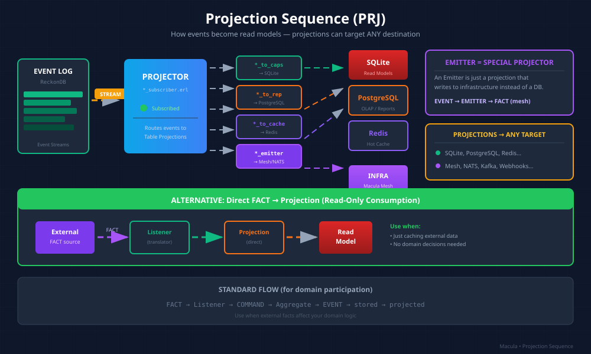

# Division Architecture: Projection Sequence (PRJ)

> *Note: "Cartwheel" is the historical name for what is now called "Division Architecture".*

> How events become read models — the materialization side of CQRS.



## Overview

The Projection Sequence (PRJ) transforms events from the event log into optimized read models. It's responsible for:

1. Subscribing to event streams
2. Processing events in order
3. Transforming event data
4. Updating read model tables
5. Maintaining consistency between events and read models

**Key Insight**: Projections do all the heavy lifting so queries can be simple. All calculations, joins, and aggregations happen here, not at query time.

## The Flow

```
Event Log → Stream → Projector → Events → Exchange → Table Projections → Cache/DB
```

Let's break down each component:

### 1. Event Log (Source)

The event log is the source of truth. It contains all domain events, organized into streams:

```
Stream: capability-mri:capability:io.macula/weather
├── capability_announced_v1 (version 0)
├── capability_updated_v1 (version 1)
└── capability_revoked_v1 (version 2)

Stream: reputation-did:macula:agent123
├── rpc_call_tracked_v1 (version 0)
├── rpc_call_tracked_v1 (version 1)
├── dispute_flagged_v1 (version 2)
└── dispute_resolved_v1 (version 3)
```

### 2. Stream Subscription

The Projector subscribes to event streams and receives events in order:

```erlang
%% query_capabilities_subscriber.erl -- an evoq_event_handler; evoq does
%% the subscribing and the checkpointing, this module only names the
%% event types and processes them. Started by the owning supervisor as
%% {evoq_event_handler, start_link, [query_capabilities_subscriber, #{}]}.
-module(query_capabilities_subscriber).
-behaviour(evoq_event_handler).

-export([interested_in/0, init/1, handle_event/4]).

interested_in() ->
    [<<"capability_announced_v1">>, <<"capability_revoked_v1">>].

init(_Config) ->
    {ok, #{}}.

handle_event(_EventType, Event, _Metadata, State) ->
    ok = process_event(Event),
    %% Returning {ok, State} IS the checkpoint -- no manual ack.
    {ok, State}.
```

**Key Pattern**: the handler's checkpoint advances only when `handle_event/4` returns `{ok, State}`. If it crashes and restarts, evoq resumes it from the last checkpointed event.

### 3. Projector

The Projector receives events and routes them to appropriate handlers:

```erlang
%% The stored envelope is a map: #{event_type, data, metadata, ...}
process_event(#{event_type := Type} = Event) ->
    case Type of
        <<"capability_announced_v1">> ->
            capability_announced_v1_to_capabilities:project(Event);
        <<"capability_revoked_v1">> ->
            capability_revoked_v1_to_capabilities:project(Event);
        _ ->
            %% Unknown event type - log and skip
            logger:warning("Unknown event type: ~p", [Type]),
            ok
    end.
```

**Key Insight**: One Projector can feed multiple Table Projections. A single event might update several read model tables.

### 4. Exchange

The Exchange routes events to multiple projections:

```erlang
%% Conceptually, the exchange fans out events:

process_event(Event = #evoq_event{event_type = <<"rpc_call_tracked_v1">>}) ->
    %% Same event updates multiple tables
    ok = rpc_call_tracked_v1_to_reputation:project(Event),  % Updates reputation score
    ok = rpc_call_tracked_v1_to_rpc_calls:project(Event),   % Updates call history
    ok = rpc_call_tracked_v1_to_analytics:project(Event),   % Updates analytics
    ok.
```

### 5. Table Projection

Each Table Projection transforms an event into database operations:

```erlang
%% capability_announced_v1_to_capabilities.erl
-module(capability_announced_v1_to_capabilities).
-export([project/1]).

project(#evoq_event{data = Data, metadata = Meta}) ->
    %% Extract data from event
    #{
        capability_mri := MRI,
        agent_identity := AgentId,
        tags := Tags,
        description := Description,
        timestamp := Timestamp
    } = Data,

    %% Transform to read model format
    Row = #{
        mri => MRI,
        agent_id => AgentId,
        tags => tags_to_json(Tags),
        description => Description,
        status => <<"active">>,
        announced_at => Timestamp,
        updated_at => Timestamp
    },

    %% Upsert into read model table
    query_capabilities_store:upsert(Row).
```

**Naming Convention**: Projections are named `{event_type}_to_{table}`. This makes it clear which event updates which table.

### 6. Cache/DB (Read Models)

Read models are stored in SQLite, optimized for fast queries:

```sql
-- capabilities table (read model)
CREATE TABLE capabilities (
    mri TEXT PRIMARY KEY,
    agent_id TEXT NOT NULL,
    tags TEXT,  -- JSON array
    description TEXT,
    status TEXT DEFAULT 'active',
    announced_at INTEGER,
    updated_at INTEGER
);

-- Indexes for common query patterns
CREATE INDEX idx_capabilities_agent ON capabilities(agent_id);
CREATE INDEX idx_capabilities_status ON capabilities(status);
```

**Key Insight**: Read models are denormalized and pre-computed. No joins at query time!

## Projection Targets: Not Just Databases!

Projections can write to **any destination**, not just databases:

| Target Type | Examples | Use Case |
|-------------|----------|----------|
| **SQL Database** | SQLite, PostgreSQL, MySQL | Structured queries, reports |
| **Cache** | Redis, ETS | Hot data, session state |
| **Search** | Elasticsearch, Meilisearch | Full-text search |
| **Infrastructure** | Macula Mesh, NATS, Kafka | External integration |

### Example: Multiple Targets from Same Event

```erlang
%% The same event can project to multiple destinations:
process_event(Event = #evoq_event{event_type = <<"capability_announced_v1">>}) ->
    %% 1. SQLite for queries
    ok = capability_announced_v1_to_capabilities:project(Event),

    %% 2. Redis for hot cache
    ok = capability_announced_v1_to_cache:project(Event),

    %% 3. Elasticsearch for search
    ok = capability_announced_v1_to_search:project(Event),

    ok.
```

## Emitters: Projections to Infrastructure

**Key Insight**: An Emitter is just a projection that writes to infrastructure instead of a database.

```
Regular Projection:  EVENT → transform → DATABASE
Emitter:            EVENT → transform → MESH/NATS/KAFKA
```

The pattern is identical — the only difference is the destination:

```erlang
%% capability_announced_v1_to_mesh.erl
%% This IS a projection — it just writes to the mesh instead of SQLite
-module(capability_announced_v1_to_mesh).
-behaviour(evoq_event_handler).

-export([interested_in/0, init/1, handle_event/4]).

interested_in() -> [<<"capability_announced_v1">>].

init(_Config) -> {ok, #{}}.

%% Business fields live under `data' in the stored envelope (Demon 40).
handle_event(_EventType, #{data := EventData}, _Metadata, State) ->
    %% Transform EVENT to FACT (different structure!)
    Fact = event_to_fact(EventData),

    %% "Project" to mesh instead of database -- mcl_om owns the pool
    %% and realm, macula_publisher supervises the publish (see
    %% skills/codegen/erlang/CODEGEN_ERLANG_TEMPLATES.md, {event}_to_mesh).
    {ok, Pool, Realm} = mcl_om:mesh_handles(),
    {ok, _} = macula_publisher:start_link(?MODULE, Pool, Realm,
                                          <<"capability/available">>, Fact),

    %% No manual ack: returning {ok, State} checkpoints the event.
    {ok, State}.

%% The FACT is a PUBLIC CONTRACT, different from internal EVENT
event_to_fact(#{capability_mri := MRI, agent_identity := Agent, description := Desc}) ->
    #{
        mri => MRI,
        agent => Agent,
        description => Desc,
        available_at => erlang:system_time(millisecond)
    }.
```

**Why this matters**: Thinking of Emitters as projections unifies the mental model. All event consumers are projections — they just have different targets.

## Alternative: Direct FACT → Projection

Sometimes you receive external FACTs that you just want to cache/mirror **without domain participation**. In this case, you can skip the full CMD flow:

### When to Use Direct Projection

| Scenario | Use Direct Projection? |
|----------|----------------------|
| Caching external agent capabilities | ✅ Yes |
| Mirroring a catalog from another service | ✅ Yes |
| Building a search index of external data | ✅ Yes |
| Making decisions based on external data | ❌ No — use full CMD flow |
| Updating your own aggregate state | ❌ No — use full CMD flow |

### Direct Flow (Read-Only)

```
External FACT → Listener (translate) → Projection → Read Model
```

```erlang
%% remote_capability_listener.erl
%% For read-only consumption of external capabilities
handle_info({mesh_fact, Topic, Fact}, State) ->
    %% Translate external FACT structure to internal format
    InternalFormat = translate_fact(Fact),

    %% Project directly to read model (no command/aggregate)
    remote_capabilities_projection:project(InternalFormat),

    {noreply, State}.
```

### Full Flow (Domain Participation)

If the external data affects your domain logic, use the full flow:

```
External FACT → Listener → COMMAND → Aggregate → EVENT → stored → projected
```

```erlang
%% trust_evaluation_listener.erl
%% When external data affects our trust decisions
handle_info({mesh_fact, Topic, Fact}, State) ->
    %% Convert to command (domain will make decisions)
    Cmd = evaluate_trust_v1:from_fact(Fact),

    %% Full command/aggregate flow
    maybe_evaluate_trust:dispatch(Cmd),

    {noreply, State}.
```

**Rule of thumb**: If you're just displaying/caching external data, use direct projection. If your domain needs to reason about or react to the data, use the full CMD flow.

## Complete Example: Reputation Projection

Let's trace a complete example from event to read model:

### Event: `rpc_call_tracked_v1`

```erlang
%% Event emitted when an RPC call completes
#{
    event_type => <<"rpc_call_tracked_v1">>,
    stream_id => <<"reputation-did:macula:agent123">>,
    data => #{
        caller_id => <<"did:macula:caller456">>,
        callee_id => <<"did:macula:agent123">>,
        procedure => <<"io.macula.agent123.analyze">>,
        success => true,
        latency_ms => 234,
        timestamp => 1703001234567
    }
}
```

### Projection 1: Update Reputation Score

```erlang
%% rpc_call_tracked_v1_to_reputation.erl
project(#evoq_event{data = Data}) ->
    #{callee_id := AgentId, success := Success} = Data,

    %% Load current reputation
    Current = query_reputation_store:get_reputation(AgentId),

    %% Calculate new values
    NewCalls = Current#reputation.total_calls + 1,
    NewSuccesses = case Success of
        true -> Current#reputation.successful_calls + 1;
        false -> Current#reputation.successful_calls
    end,
    NewScore = calculate_score(NewSuccesses, NewCalls),

    %% Update read model
    query_reputation_store:update_reputation(AgentId, #{
        total_calls => NewCalls,
        successful_calls => NewSuccesses,
        success_rate => NewSuccesses / NewCalls * 100,
        score => NewScore,
        updated_at => erlang:system_time(millisecond)
    }).

calculate_score(Successes, Total) ->
    %% Bayesian average with prior of 3.0
    Prior = 3.0,
    PriorWeight = 10,
    (Prior * PriorWeight + Successes * 5.0) / (PriorWeight + Total).
```

### Projection 2: Update Call History

```erlang
%% rpc_call_tracked_v1_to_rpc_calls.erl
project(#evoq_event{data = Data, metadata = Meta}) ->
    #{
        caller_id := CallerId,
        callee_id := CalleeId,
        procedure := Procedure,
        success := Success,
        latency_ms := Latency,
        timestamp := Timestamp
    } = Data,

    %% Insert into call history table
    query_reputation_store:insert_rpc_call(#{
        id => maps:get(correlation_id, Meta, generate_id()),
        caller_id => CallerId,
        callee_id => CalleeId,
        procedure => Procedure,
        success => Success,
        latency_ms => Latency,
        created_at => Timestamp
    }).
```

**Key Insight**: The same event updates two different tables. The reputation table has aggregated scores; the rpc_calls table has individual records.

## Handling Multiple Events

Some read models need data from multiple event types:

```erlang
%% dispute_to_disputes.erl handles both:
%% - dispute_flagged_v1 (creates dispute record)
%% - dispute_resolved_v1 (updates dispute status)

project(#evoq_event{event_type = <<"dispute_flagged_v1">>, data = Data}) ->
    %% Create new dispute record
    query_disputes_store:insert(#{
        id => Data#dispute_flagged_v1.dispute_id,
        reporter_id => Data#dispute_flagged_v1.reporter_id,
        accused_id => Data#dispute_flagged_v1.accused_id,
        reason => Data#dispute_flagged_v1.reason,
        status => <<"open">>,
        created_at => Data#dispute_flagged_v1.timestamp
    });

project(#evoq_event{event_type = <<"dispute_resolved_v1">>, data = Data}) ->
    %% Update existing dispute
    query_disputes_store:update(Data#dispute_resolved_v1.dispute_id, #{
        status => Data#dispute_resolved_v1.resolution,
        resolved_by => Data#dispute_resolved_v1.resolver_id,
        resolved_at => Data#dispute_resolved_v1.timestamp
    }).
```

## Error Handling

Projections must be idempotent (safe to replay):

```erlang
%% Good: Idempotent upsert
project(Event) ->
    Row = event_to_row(Event),
    %% UPSERT: Insert or update if exists
    query_store:upsert(Row#row.id, Row).

%% Bad: Not idempotent
project(Event) ->
    Row = event_to_row(Event),
    %% INSERT: Will fail on replay!
    query_store:insert(Row).
```

If a projection fails:

1. **Log the error** with full event context
2. **Skip the event** and continue
3. **Alert** if too many failures
4. **Manual intervention** may be needed to fix data

```erlang
project(Event) ->
    try
        do_projection(Event)
    catch
        Class:Reason:Stack ->
            logger:error("Projection failed: ~p:~p~nEvent: ~p~nStack: ~p",
                        [Class, Reason, Event, Stack]),
            %% Continue processing - don't block the stream
            ok
    end.
```

## Rebuilding Projections

Sometimes you need to rebuild a projection from scratch:

```erlang
%% rebuild_capabilities_projection.erl
rebuild() ->
    %% 1. Clear the read model table
    query_capabilities_store:truncate(),

    %% 2+3. Reset the checkpoint and replay every event through the
    %%      projection -- evoq_projection:rebuild/1 does both
    ok = evoq_projection:rebuild(capabilities_projector).
```

**When to rebuild**:
- Projection logic changed
- Bug caused incorrect data
- New read model table added
- Schema migration required

## Macula Implementation

```
apps/query_capabilities/
└── src/
    ├── query_capabilities_app.erl
    ├── query_capabilities_sup.erl
    ├── query_capabilities_subscriber.erl    # Projector
    ├── query_capabilities_store.erl         # SQLite access
    └── projections/
        ├── capability_announced_v1_to_capabilities.erl
        └── capability_revoked_v1_to_capabilities.erl
```

## Testing Projections

```erlang
%% test/capability_projection_test.erl
project_announced_capability_test() ->
    %% Given: An announced event
    Event = #evoq_event{
        event_type = <<"capability_announced_v1">>,
        data = #{
            capability_mri => <<"mri:capability:io.macula/test">>,
            agent_identity => <<"did:macula:agent123">>,
            tags => [<<"test">>],
            description => <<"Test capability">>,
            timestamp => 1703001234567
        }
    },

    %% When: Project the event
    ok = capability_announced_v1_to_capabilities:project(Event),

    %% Then: Read model is updated
    {ok, Row} = query_capabilities_store:get(<<"mri:capability:io.macula/test">>),
    ?assertEqual(<<"active">>, Row#capability.status),
    ?assertEqual(<<"did:macula:agent123">>, Row#capability.agent_id).

project_is_idempotent_test() ->
    Event = make_test_event(),

    %% Project twice
    ok = capability_announced_v1_to_capabilities:project(Event),
    ok = capability_announced_v1_to_capabilities:project(Event),

    %% Only one record exists
    {ok, [Row]} = query_capabilities_store:list_all(),
    ?assertEqual(1, length([Row])).
```

## Summary

The Projection Sequence ensures:

1. **Fast queries**: All calculations done upfront
2. **Consistency**: Events are processed in order
3. **Recoverability**: Can rebuild from event log
4. **Flexibility**: Multiple read models from same events

## Next Steps

- [Query Sequence](CARTWHEEL_QUERY_SEQUENCE.md) — How data is retrieved
- [Write Sequence](CARTWHEEL_WRITE_SEQUENCE.md) — How events are created
- [Overview](CARTWHEEL_OVERVIEW.md) — Return to main guide

---

*The Projection Sequence is the "truth translator" of the system. It takes the raw events and transforms them into shapes that are perfect for querying.*
