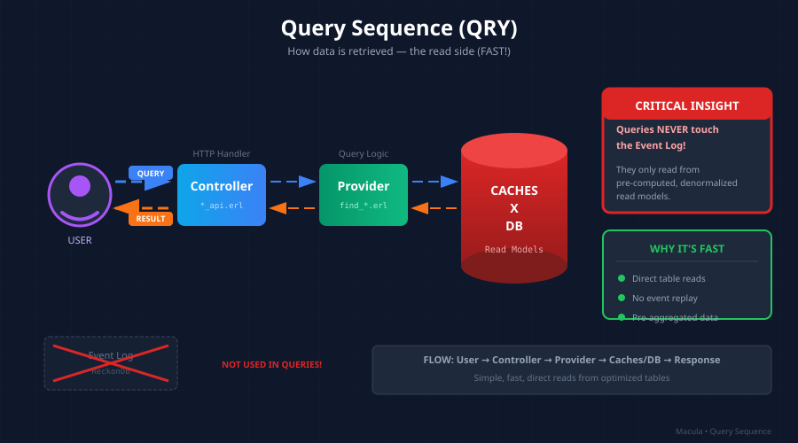

# Division Architecture: Query Sequence (QRY)

> *Note: "Cartwheel" is the historical name for what is now called "Division Architecture".*

> How data is retrieved — the read side of CQRS.



## Overview

The Query Sequence (QRY) serves read requests from pre-computed read models. It's responsible for:

1. Receiving query requests
2. Routing to appropriate handlers
3. Fetching from optimized read models
4. Returning results quickly

**Key Insight**: Queries are *boring* by design. All the interesting work happened in the [Projection Sequence](CARTWHEEL_PROJECTION_SEQUENCE.md). Queries just fetch pre-computed data.

## The Flow

```
User → Controller → Provider → Cache/DB (Read Model)
```

Let's break down each component:

### 1. User/Client

The query originates from:
- HTTP API requests
- WAMP RPC calls via the mesh
- Internal system queries

```erlang
%% Example: HTTP GET /api/capabilities?agent_id=did:macula:agent123
%% Example: WAMP call to io.macula.mcl.capabilities.list
```

### 2. Controller

The Controller receives the request and extracts query parameters:

```erlang
%% mcl_api_capabilities.erl
handle_get(Req, State) ->
    %% Extract query parameters
    AgentId = cowboy_req:binding(agent_id, Req),
    Tags = cowboy_req:parse_qs(Req),

    %% Build query
    Query = #{
        agent_id => AgentId,
        tags => proplists:get_all_values(<<"tag">>, Tags)
    },

    %% Delegate to provider
    case query_capabilities:find(Query) of
        {ok, Capabilities} ->
            {json:encode(Capabilities), Req, State};
        {error, not_found} ->
            {404, Req, State}
    end.
```

**Key Pattern**: Controllers do NO business logic. They translate HTTP/WAMP to query calls and format responses.

### 3. Provider

The Provider is the query service's public API. It exposes typed query functions:

```erlang
%% query_capabilities.erl
-module(query_capabilities).
-export([find/1, get/1, list_by_agent/1, search/1]).

%% Find capabilities matching criteria
find(#{agent_id := AgentId} = Query) ->
    query_capabilities_store:find_by_agent(AgentId, Query);

find(#{tags := Tags} = Query) ->
    query_capabilities_store:find_by_tags(Tags, Query);

find(Query) ->
    query_capabilities_store:find_all(Query).

%% Get a single capability by MRI
get(MRI) ->
    query_capabilities_store:get(MRI).

%% List all capabilities for an agent
list_by_agent(AgentId) ->
    query_capabilities_store:find_by_agent(AgentId, #{}).

%% Full-text search
search(SearchTerm) ->
    query_capabilities_store:search(SearchTerm).
```

**Key Insight**: Providers define the query vocabulary. Each function represents a specific way to query the domain.

### 4. Cache/DB (Read Models)

Read models are stored in SQLite, optimized for the exact queries the Provider exposes:

```erlang
%% query_capabilities_store.erl
-module(query_capabilities_store).
-export([get/1, find_by_agent/2, find_by_tags/2, search/1]).

%% Direct primary key lookup - O(1)
get(MRI) ->
    case sqlite3:read(capabilities_db, capabilities, [{mri, MRI}]) of
        [{Row}] -> {ok, row_to_capability(Row)};
        [] -> {error, not_found}
    end.

%% Index-backed query
find_by_agent(AgentId, Opts) ->
    Limit = maps:get(limit, Opts, 100),
    Offset = maps:get(offset, Opts, 0),

    SQL = "SELECT * FROM capabilities
           WHERE agent_id = ?1
           AND status = 'active'
           ORDER BY announced_at DESC
           LIMIT ?2 OFFSET ?3",

    {ok, Rows} = sqlite3:sql_exec(capabilities_db, SQL, [AgentId, Limit, Offset]),
    {ok, [row_to_capability(R) || R <- Rows]}.

%% Tag-based filtering (JSON array in SQLite)
find_by_tags(Tags, Opts) ->
    %% Use SQLite JSON functions
    TagConditions = [io_lib:format("json_each.value = '~s'", [T]) || T <- Tags],
    WhereClause = string:join(TagConditions, " OR "),

    SQL = io_lib:format(
        "SELECT DISTINCT c.* FROM capabilities c, json_each(c.tags)
         WHERE (~s) AND c.status = 'active'",
        [WhereClause]
    ),

    {ok, Rows} = sqlite3:sql_exec(capabilities_db, SQL),
    {ok, [row_to_capability(R) || R <- Rows]}.

%% Full-text search using SQLite FTS5
search(Term) ->
    SQL = "SELECT c.* FROM capabilities c
           JOIN capabilities_fts ON c.mri = capabilities_fts.mri
           WHERE capabilities_fts MATCH ?1",

    {ok, Rows} = sqlite3:sql_exec(capabilities_db, SQL, [Term]),
    {ok, [row_to_capability(R) || R <- Rows]}.
```

## Why Queries Are Fast

The Query Sequence is optimized for speed:

| Optimization | How it Works |
|--------------|--------------|
| **Pre-computed** | Projections already calculated all aggregations |
| **Denormalized** | No joins needed - data is already in query shape |
| **Indexed** | Indexes match exactly what queries need |
| **Cached** | Hot data can be cached in memory |
| **Simple** | Just SELECT with WHERE - no complex logic |

### The Critical Insight

**Queries NEVER touch the Event Log!**

```
❌ WRONG: Query → Event Log → Replay → Calculate → Return
✅ RIGHT: Query → Read Model → Return
```

This is why CQRS exists: the read path is completely separated from the write path.

## Complete Example: Reputation Query

Let's trace a complete query from request to response:

### Request

```
GET /api/agents/did:macula:agent123/reputation
```

### Controller

```erlang
%% mcl_api_reputation.erl
handle_get(Req, State) ->
    AgentId = cowboy_req:binding(agent_id, Req),

    case query_reputation:get_reputation(AgentId) of
        {ok, Reputation} ->
            Response = #{
                agent_id => AgentId,
                score => Reputation#reputation.score,
                total_calls => Reputation#reputation.total_calls,
                success_rate => Reputation#reputation.success_rate,
                updated_at => Reputation#reputation.updated_at
            },
            {json:encode(Response), Req, State};
        {error, not_found} ->
            %% Return default reputation for unknown agents
            Default = #{
                agent_id => AgentId,
                score => 3.0,  % Neutral score
                total_calls => 0,
                success_rate => 0.0,
                updated_at => null
            },
            {json:encode(Default), Req, State}
    end.
```

### Provider

```erlang
%% query_reputation.erl
-module(query_reputation).
-export([get_reputation/1, list_top_agents/1, get_call_history/2]).

get_reputation(AgentId) ->
    query_reputation_store:get_reputation(AgentId).

list_top_agents(Limit) ->
    query_reputation_store:list_top_by_score(Limit).

get_call_history(AgentId, Opts) ->
    query_reputation_store:list_rpc_calls(AgentId, Opts).
```

### Store (Read Model)

```erlang
%% query_reputation_store.erl
get_reputation(AgentId) ->
    SQL = "SELECT * FROM reputation WHERE agent_id = ?1",
    case sqlite3:sql_exec(reputation_db, SQL, [AgentId]) of
        {ok, [Row]} -> {ok, row_to_reputation(Row)};
        {ok, []} -> {error, not_found}
    end.

list_top_by_score(Limit) ->
    SQL = "SELECT * FROM reputation
           WHERE total_calls >= 10  -- Minimum calls for ranking
           ORDER BY score DESC
           LIMIT ?1",
    {ok, Rows} = sqlite3:sql_exec(reputation_db, SQL, [Limit]),
    {ok, [row_to_reputation(R) || R <- Rows]}.
```

## Read Model Schema Design

Design read models for the queries you need:

```sql
-- reputation table
CREATE TABLE reputation (
    agent_id TEXT PRIMARY KEY,
    score REAL NOT NULL DEFAULT 3.0,
    total_calls INTEGER NOT NULL DEFAULT 0,
    successful_calls INTEGER NOT NULL DEFAULT 0,
    success_rate REAL NOT NULL DEFAULT 0.0,
    last_call_at INTEGER,
    updated_at INTEGER NOT NULL
);

-- Indexes for common queries
CREATE INDEX idx_reputation_score ON reputation(score DESC);
CREATE INDEX idx_reputation_updated ON reputation(updated_at DESC);

-- rpc_calls table (for history queries)
CREATE TABLE rpc_calls (
    id TEXT PRIMARY KEY,
    caller_id TEXT NOT NULL,
    callee_id TEXT NOT NULL,
    procedure TEXT NOT NULL,
    success INTEGER NOT NULL,
    latency_ms INTEGER,
    created_at INTEGER NOT NULL
);

-- Indexes for call history queries
CREATE INDEX idx_calls_callee ON rpc_calls(callee_id, created_at DESC);
CREATE INDEX idx_calls_caller ON rpc_calls(caller_id, created_at DESC);
CREATE INDEX idx_calls_procedure ON rpc_calls(procedure);
```

**Key Insight**: Each index exists because there's a query that needs it. Don't add indexes "just in case."

## Query Patterns

### Pattern 1: Direct Lookup

Fetch a single entity by ID:

```erlang
get(Id) ->
    store:get_by_id(Id).
```

### Pattern 2: Filtered List

Fetch multiple entities matching criteria:

```erlang
find(#{status := Status, limit := Limit}) ->
    store:find_by_status(Status, Limit).
```

### Pattern 3: Aggregation Query

Return pre-computed aggregates:

```erlang
get_statistics(AgentId) ->
    %% These stats are already computed by projections
    store:get_agent_stats(AgentId).
```

### Pattern 4: Search

Full-text or fuzzy search:

```erlang
search(Term, Opts) ->
    store:fts_search(Term, Opts).
```

## Caching Strategy

For frequently accessed data, add an in-memory cache:

```erlang
%% query_capabilities_cache.erl
-module(query_capabilities_cache).
-behaviour(gen_server).

%% Cache hot capabilities in ETS
init([]) ->
    ets:new(?MODULE, [named_table, public, {read_concurrency, true}]),
    {ok, #{}}.

get(MRI) ->
    case ets:lookup(?MODULE, MRI) of
        [{MRI, Capability, ExpiresAt}] when ExpiresAt > erlang:system_time(second) ->
            {ok, Capability};
        _ ->
            %% Cache miss - fetch from SQLite
            case query_capabilities_store:get(MRI) of
                {ok, Capability} = Result ->
                    cache_put(MRI, Capability),
                    Result;
                Error ->
                    Error
            end
    end.

cache_put(MRI, Capability) ->
    ExpiresAt = erlang:system_time(second) + 300,  % 5 minute TTL
    ets:insert(?MODULE, {MRI, Capability, ExpiresAt}).

%% Invalidate when projection updates
invalidate(MRI) ->
    ets:delete(?MODULE, MRI).
```

**Cache Invalidation**: When projections update a read model, they should invalidate the cache.

## Error Handling

Query errors should be simple:

```erlang
%% Good: Return clear error tuples
get(Id) ->
    case store:get(Id) of
        {ok, Row} -> {ok, row_to_record(Row)};
        {ok, []} -> {error, not_found};
        {error, Reason} -> {error, {db_error, Reason}}
    end.

%% In controller - translate to HTTP status
case query:get(Id) of
    {ok, Data} -> {200, json:encode(Data), Req};
    {error, not_found} -> {404, <<"Not found">>, Req};
    {error, {db_error, _}} -> {500, <<"Internal error">>, Req}
end.
```

## Macula Implementation

**CRITICAL: Query module naming must scream intent. See `skills/codegen/erlang/CODEGEN_ERLANG_NAMING.md` and `skills/NAMING_CONVENTIONS.md`.**

| Rule | Anti-Pattern | Correct |
|------|-------------|---------|
| Specify lookup strategy | `get_venture` | `get_venture_by_id` |
| Always page list queries | `list_ventures` | `get_ventures_page` |
| Never return unbounded | `get_all_divisions` | `get_divisions_page` |

```
apps/query_capabilities/
└── src/
    ├── query_capabilities_app.erl
    ├── query_capabilities_sup.erl
    ├── query_capabilities_store.erl             # SQLite access
    ├── get_capability_by_id/                    # Single lookup by PK
    │   ├── get_capability_by_id.erl
    │   └── get_capability_by_id_api.erl
    ├── get_capabilities_page/                   # Paged list (bounded)
    │   ├── get_capabilities_page.erl
    │   └── get_capabilities_page_api.erl
    ├── capability_announced_v1_to_capabilities/  # Projection desk
    │   └── ...
    └── query_capabilities_cache.erl             # Optional ETS cache
```

## Testing Queries

```erlang
%% test/query_capabilities_test.erl

%% Test direct lookup
get_existing_capability_test() ->
    %% Given: A capability exists in the read model
    setup_capability(<<"mri:capability:io.macula/test">>),

    %% When: Query by MRI
    {ok, Capability} = query_capabilities:get(<<"mri:capability:io.macula/test">>),

    %% Then: Returns the capability
    ?assertEqual(<<"active">>, Capability#capability.status).

get_missing_capability_test() ->
    %% When: Query non-existent MRI
    Result = query_capabilities:get(<<"mri:capability:io.macula/does-not-exist">>),

    %% Then: Returns not_found
    ?assertEqual({error, not_found}, Result).

%% Test filtered queries
find_by_agent_test() ->
    %% Given: Multiple capabilities for an agent
    AgentId = <<"did:macula:agent123">>,
    setup_capabilities_for_agent(AgentId, 5),

    %% When: Query by agent
    {ok, Capabilities} = query_capabilities:list_by_agent(AgentId),

    %% Then: Returns all capabilities
    ?assertEqual(5, length(Capabilities)),
    lists:foreach(fun(C) ->
        ?assertEqual(AgentId, C#capability.agent_id)
    end, Capabilities).

%% Test pagination
find_with_pagination_test() ->
    %% Given: 100 capabilities
    setup_many_capabilities(100),

    %% When: Query with limit and offset
    {ok, Page1} = query_capabilities:find(#{limit => 10, offset => 0}),
    {ok, Page2} = query_capabilities:find(#{limit => 10, offset => 10}),

    %% Then: Returns correct pages
    ?assertEqual(10, length(Page1)),
    ?assertEqual(10, length(Page2)),
    ?assertNotEqual(Page1, Page2).  % Different pages
```

## Performance Considerations

### Query Performance Targets

| Query Type | Target Latency | Notes |
|------------|---------------|-------|
| Direct lookup (by PK) | < 1ms | Should be O(1) |
| Indexed filter | < 10ms | Depends on result size |
| Full-text search | < 50ms | FTS5 optimized |
| Complex filter | < 100ms | Multiple conditions |

### If Queries Are Slow

1. **Check indexes**: Run `EXPLAIN QUERY PLAN` in SQLite
2. **Add caching**: Hot data should be in ETS
3. **Denormalize more**: Maybe projections should pre-join data
4. **Paginate**: Never return unbounded result sets

## Summary

The Query Sequence ensures:

1. **Speed**: Pre-computed data, no joins, indexed queries
2. **Simplicity**: Queries are just SELECT statements
3. **Isolation**: Read path is completely separate from write path
4. **Scalability**: Read models can be replicated/cached independently

## Next Steps

- [Write Sequence](CARTWHEEL_WRITE_SEQUENCE.md) — How events are created
- [Projection Sequence](CARTWHEEL_PROJECTION_SEQUENCE.md) — How events become read models
- [Overview](CARTWHEEL_OVERVIEW.md) — Return to main guide

---

*The Query Sequence is the "truth deliverer" of the system. It takes the pre-computed read models and serves them as fast as possible.*
