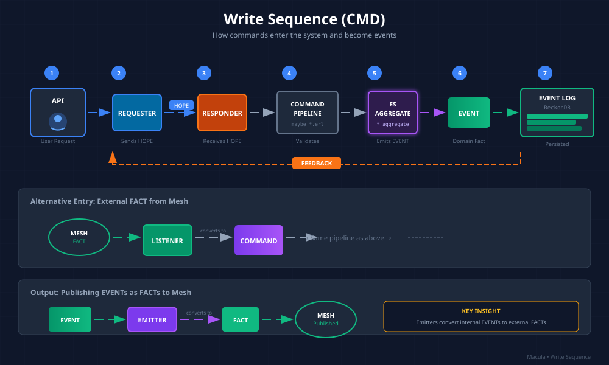

# Division Architecture: Write Sequence (CMD)

> *Note: "Cartwheel" is the historical name for what is now called "Division Architecture".*

> How commands enter the system and become events — the write side of CQRS.



## Overview

The Write Sequence (CMD) handles all state changes in the system. It's responsible for:

1. Receiving commands (from API or Mesh)
2. Validating business rules
3. Updating aggregate state
4. Emitting domain events
5. Persisting events to the event log

**Key Insight**: The write side is optimized for correctness and consistency, not speed. If you need fast reads, use the [Query Sequence](CARTWHEEL_QUERY_SEQUENCE.md).

## The Flow

```
API Request → Requester → HOPE → Responder → Command Pipeline → Aggregate → EVENT → Event Log
```

Let's break down each component:

### 1. API Layer

The entry point for external requests:

```erlang
%% mcl_api_capabilities.erl
handle_post(Req, State) ->
    {ok, Body, Req2} = cowboy_req:read_body(Req),
    #{<<"name">> := Name, <<"tags">> := Tags} = json:decode(Body),

    %% Create and dispatch command
    Cmd = announce_capability_v1:new(Name, Tags, ...),
    case maybe_announce_capability:dispatch(Cmd) of
        {ok, Event} ->
            {json:encode(#{ok => true}), Req2, State};
        {error, Reason} ->
            {json:encode(#{ok => false, error => Reason}), Req2, State}
    end.
```

### 2. Requester (for RPC calls)

When calling another agent via the mesh:

```erlang
%% The Requester sends a HOPE (RPC request)
%% "HOPE" because we optimistically hope the remote agent will execute it
mcl_om:call(<<"io.macula.other-agent.analyze">>, Args, Timeout)
```

The Requester:
- Packages the call as a HOPE message
- Sends it via the mesh
- Waits for FEEDBACK (response)
- Returns the result to the caller

### 3. Responder (for incoming RPC)

Handles incoming HOPEs from other agents:

```erlang
%% The Responder receives a HOPE and processes it
handle_hope(Hope) ->
    %% Convert HOPE to internal COMMAND
    Cmd = hope_to_command(Hope),

    %% Dispatch through normal command flow
    case dispatch_command(Cmd) of
        {ok, Result} ->
            {feedback, success, Result};
        {error, Reason} ->
            {feedback, error, Reason}
    end.
```

### 4. Command Pipeline

The command pipeline validates and routes commands:

```erlang
%% maybe_announce_capability.erl
-module(maybe_announce_capability).
-export([handle/1, dispatch/1]).

%% Entry point
dispatch(Cmd) ->
    %% 1. Load current aggregate state
    StreamId = announce_capability_v1:stream_id(Cmd),
    {ok, Aggregate} = load_aggregate(StreamId),

    %% 2. Handle command (business logic)
    case handle(Cmd, Aggregate) of
        {ok, Events} ->
            %% 3. Persist events
            ok = persist_events(StreamId, Events),
            {ok, Events};
        {error, _} = Error ->
            Error
    end.

%% Business logic - pattern match on command
handle(#announce_capability_v1{} = Cmd, Aggregate) ->
    %% Validate business rules
    case capability_aggregate:can_announce(Aggregate, Cmd) of
        true ->
            Event = capability_announced_v1:new(Cmd),
            {ok, [Event]};
        {false, Reason} ->
            {error, Reason}
    end.
```

**Key Pattern**: The handler is named `maybe_*` because success is not guaranteed — it depends on the current state and business rules.

### 5. ES Aggregate

The aggregate holds the current state and enforces invariants:

```erlang
%% capability_aggregate.erl
-module(capability_aggregate).
-export([new/0, apply_event/2, can_announce/2]).

-record(capability_aggregate, {
    mri :: binary() | undefined,
    status :: pending | active | revoked,
    announced_at :: integer() | undefined
}).

%% Create empty aggregate
new() ->
    #capability_aggregate{status = pending}.

%% Apply event to update state
apply_event(#capability_aggregate{} = Agg, #capability_announced_v1{} = Event) ->
    Agg#capability_aggregate{
        mri = Event#capability_announced_v1.capability_mri,
        status = active,
        announced_at = Event#capability_announced_v1.timestamp
    }.

%% Business rule validation
can_announce(#capability_aggregate{status = pending}, _Cmd) ->
    true;
can_announce(#capability_aggregate{status = active}, _Cmd) ->
    {false, already_announced};
can_announce(#capability_aggregate{status = revoked}, _Cmd) ->
    {false, capability_revoked}.
```

**Key Insight**: The aggregate is reconstructed by replaying all events for that stream. This is why events are immutable — they are the source of truth.

### 6. Domain Event

Events capture what happened in business terms:

```erlang
%% capability_announced_v1.erl
-module(capability_announced_v1).
-export([new/1, to_map/1, from_map/1, event_type/0]).

-record(capability_announced_v1, {
    capability_mri :: binary(),
    agent_identity :: binary(),
    tags :: [binary()],
    description :: binary(),
    timestamp :: integer()
}).

%% Event type for serialization
event_type() -> <<"capability_announced_v1">>.

%% Create from command
new(#announce_capability_v1{} = Cmd) ->
    #capability_announced_v1{
        capability_mri = Cmd#announce_capability_v1.mri,
        agent_identity = Cmd#announce_capability_v1.agent_id,
        tags = Cmd#announce_capability_v1.tags,
        description = Cmd#announce_capability_v1.description,
        timestamp = erlang:system_time(millisecond)
    }.

%% Serialization
to_map(#capability_announced_v1{} = E) ->
    #{
        capability_mri => E#capability_announced_v1.capability_mri,
        agent_identity => E#capability_announced_v1.agent_identity,
        tags => E#capability_announced_v1.tags,
        description => E#capability_announced_v1.description,
        timestamp => E#capability_announced_v1.timestamp
    }.
```

**Naming Convention**: Events are always named in past tense: `capability_announced`, `rpc_call_tracked`, `dispute_flagged`.

### 7. Event Log (ReckonDB)

Events are persisted to the event log:

```erlang
%% Persisting events is evoq's job, not the handler's: evoq_router runs the
%% aggregate's execute/2 and appends the returned events through the
%% configured adapter (evoq_event_store:append/4 -> reckon_evoq_adapter:append/4).
{ok, Version, Events} = evoq_router:dispatch(
    evoq_command:new(CommandType, AggregateMod, StreamId, Payload)).
```

The event log is:
- **Append-only**: Events can never be modified or deleted
- **Ordered**: Events within a stream are strictly ordered
- **Persistent**: Events survive restarts

## Alternative Entry: External FACT

Commands can also come from the mesh via a **Listener**:

```
Mesh FACT → Listener → COMMAND → Same pipeline as above
```

```erlang
%% capability_listener.erl
handle_fact(#{<<"type">> := <<"capability.requested">>, <<"data">> := Data}) ->
    %% Convert external FACT to internal COMMAND
    Cmd = announce_capability_v1:from_fact(Data),

    %% Dispatch through normal flow
    maybe_announce_capability:dispatch(Cmd).
```

**Key Insight**: External FACTs are converted to internal COMMANDs. The aggregate doesn't know or care where the command came from.

## Output: Publishing to Mesh

After events are stored, an **Emitter** may publish them as FACTs:

```erlang
%% capability_announced_v1_to_mesh.erl
-module(capability_announced_v1_to_mesh).

handle_event(#capability_announced_v1{} = Event) ->
    %% Convert internal EVENT to external FACT
    Fact = #{
        type => <<"capability.available">>,
        data => #{
            mri => Event#capability_announced_v1.capability_mri,
            tags => Event#capability_announced_v1.tags
        }
    },

    %% Publish to mesh
    mcl_mesh:publish(<<"capabilities.available">>, Fact).
```

**Critical**: The FACT structure may be different from the EVENT structure. The EVENT is an implementation detail; the FACT is a public contract.

## Macula Implementation

In Macula, each domain follows this pattern:

```
apps/manage_capabilities/
└── src/
    └── announce_capability/
        ├── announce_capability_v1.erl       # Command
        ├── capability_announced_v1.erl      # Event
        ├── maybe_announce_capability.erl    # Handler (dispatch + business logic)
        ├── capability_aggregate.erl         # Aggregate state
        └── capability_announced_v1_to_mesh.erl  # Emitter (optional)
```

## Error Handling

Errors in the write path should be:

1. **Business errors**: Return `{error, Reason}` from the handler
2. **Infrastructure errors**: Let it crash, supervisor will restart
3. **Never**: Silently ignore or wrap in try/catch

```erlang
%% Good: Return business error
handle(Cmd, #capability_aggregate{status = revoked}) ->
    {error, capability_revoked};

%% Good: Let infrastructure crash if ReckonDB is down
%% (supervisor handles restart)

%% Bad: Wrapping errors
handle(Cmd, Agg) ->
    try
        do_something_risky()
    catch
        _:_ -> {error, unknown}  % DON'T DO THIS
    end.
```

## Testing the Write Sequence

```erlang
%% test/capability_announce_test.erl
announce_new_capability_test() ->
    %% Given: No existing capability
    Cmd = announce_capability_v1:new(
        <<"mri:capability:io.macula/weather">>,
        [<<"weather">>, <<"forecast">>],
        <<"Weather forecasting service">>
    ),

    %% When: Dispatch command
    {ok, [Event]} = maybe_announce_capability:dispatch(Cmd),

    %% Then: Event is emitted
    ?assertEqual(capability_announced_v1, element(1, Event)),
    ?assertEqual(<<"mri:capability:io.macula/weather">>,
                 Event#capability_announced_v1.capability_mri).

announce_duplicate_capability_test() ->
    %% Given: Capability already announced
    setup_existing_capability(),

    Cmd = announce_capability_v1:new(
        <<"mri:capability:io.macula/weather">>,
        [<<"weather">>],
        <<"Duplicate">>
    ),

    %% When: Try to announce again
    Result = maybe_announce_capability:dispatch(Cmd),

    %% Then: Error returned
    ?assertEqual({error, already_announced}, Result).
```

## Summary

The Write Sequence ensures:

1. **Consistency**: All writes go through aggregates
2. **Auditability**: Every change is recorded as an event
3. **Decoupling**: Commands and events are separate from queries
4. **Testability**: Business logic is isolated in handlers

## Next Steps

- [Projection Sequence](CARTWHEEL_PROJECTION_SEQUENCE.md) — How events become read models
- [Query Sequence](CARTWHEEL_QUERY_SEQUENCE.md) — How data is retrieved
- [Overview](CARTWHEEL_OVERVIEW.md) — Return to main guide

---

*The Write Sequence is the "truth creator" of the system. Every fact about the domain starts here, as a command that becomes an event.*
